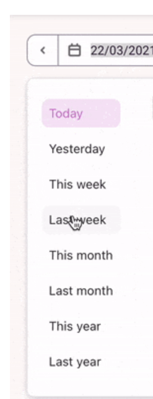

# Help selecting dates on a calendar

Provided that the implementation of a similar solution will depend on your users’ needs, the one presented here seems useful to narrow down the choice of dates.

Source: unknown, unfortunately.

#UX #Calendar #DateSelection