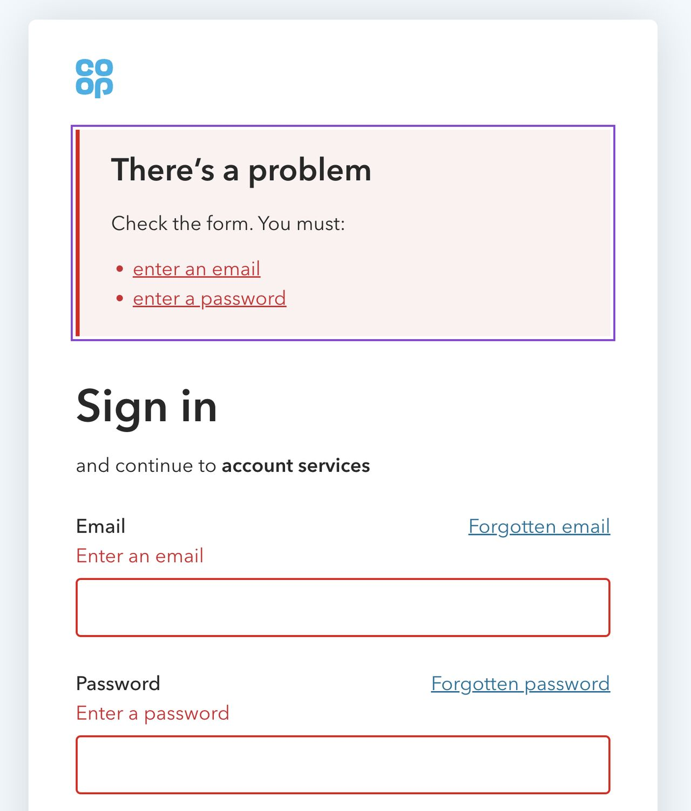
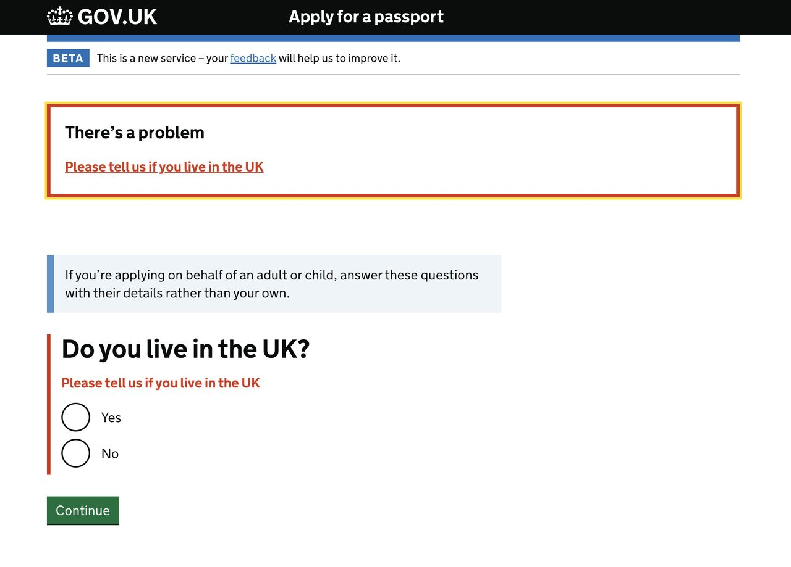
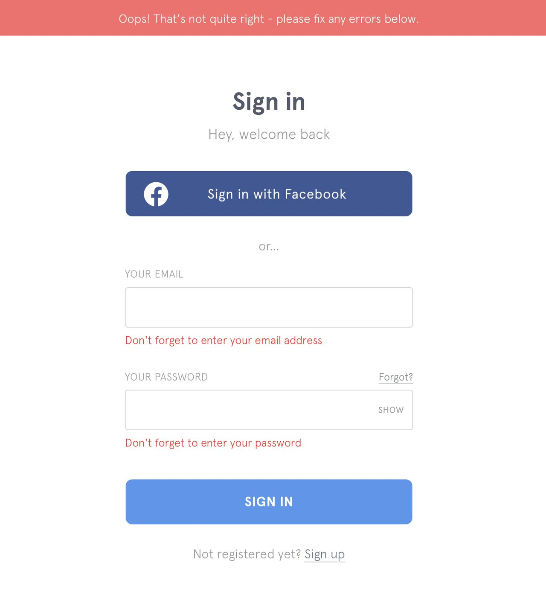
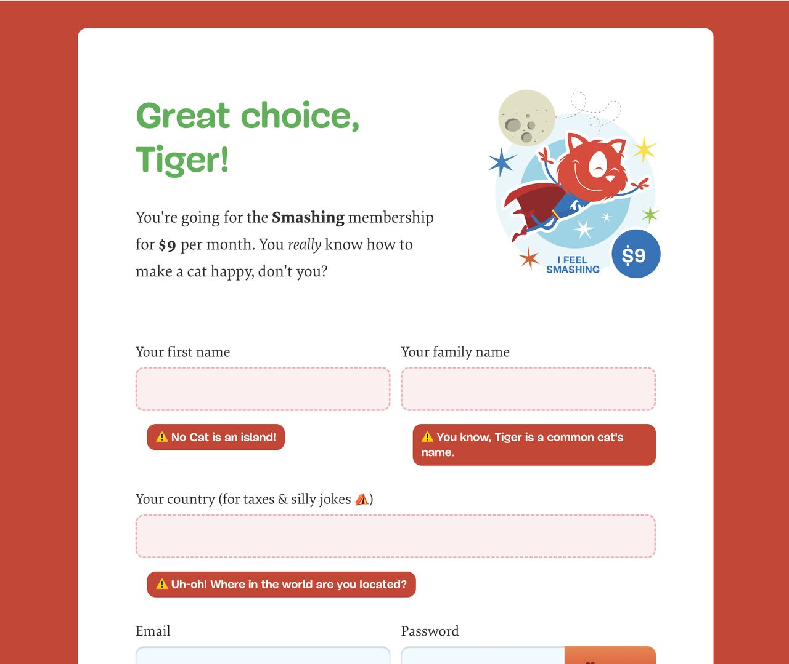
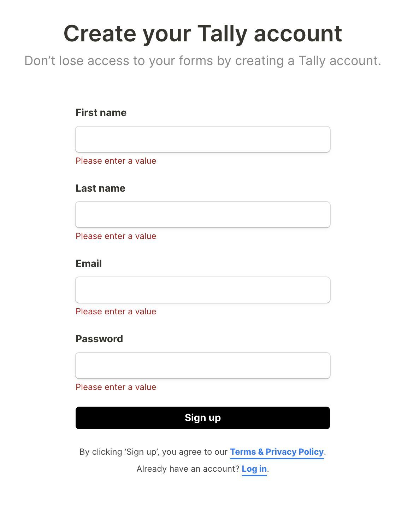
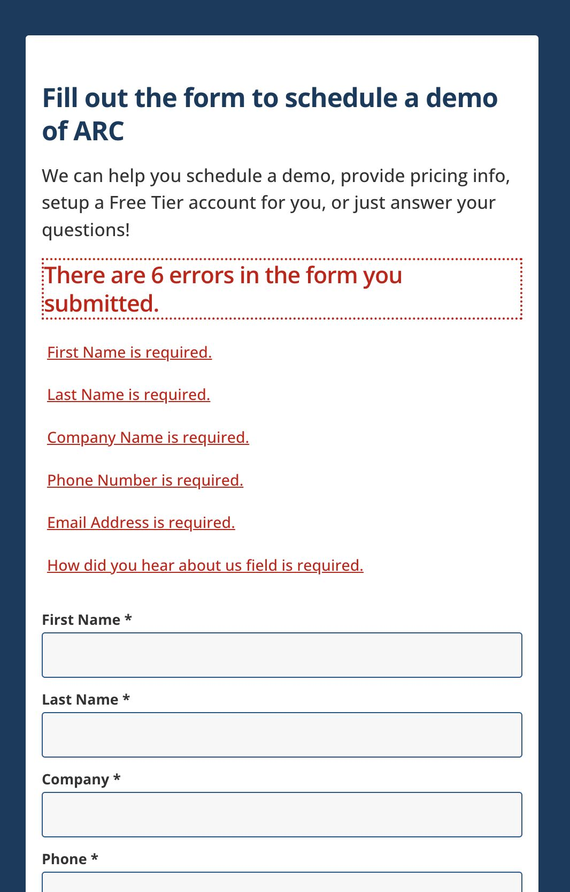
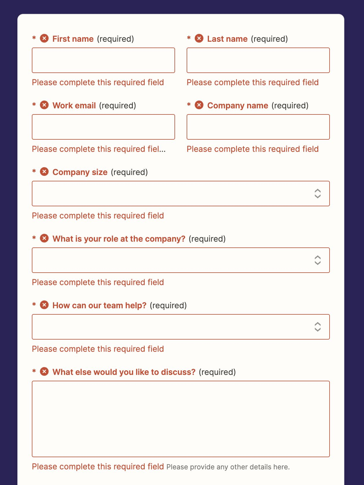

# Validating forms at submit

Certain live form validation may be perceived as aggressive. 

See article [Hostile Patterns in Error Messages](https://www.nngroup.com/articles/hostile-error-messages/) on Nielsen Norman Group.

The following forms are examples of a more relaxed way of letting people know there are errors as they are validated at submit.

## Co-op

***

## Gov.UK

***

# Kidly

***

## Smashing Magazine

***

***

***

## Zapier

***

Source: a LinkedIn post by [Adam Silver](https://adamsilver.io/)

#UX #Form