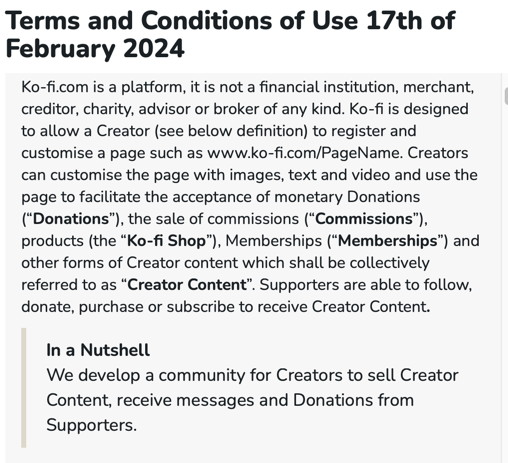

# Helpful terms & conditions

Who reads the Terms & Conditions of the digital products they use? They’re usually long and complex, so I was pleasantly surprised to see that Ko-fi offers a "in a nutshell" section at end of each paragraph to explain them.

There is a gap between companies, obliged by law to publish the terms and conditions of use of their products, and their users, who need to be informed but are likely not familiar with the legalese.

Ko-fi made and effort to bridge the gap. It’s content design done well.

#UX #ContentDesign