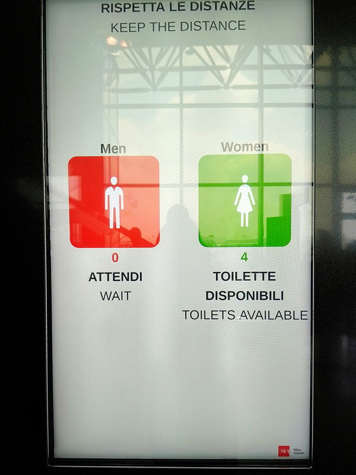

# Malpensa toilets

The display outside the toilets located in the Terminal 1 check-in area was certainly installed after 2020. 

Its initial purpose it to help people keep the distance, as stated at the top. What it does is the let people know when to stay outside is there aren’t any free toilets, which immensely useful even without COVID.

At the moment I took the picture, there were 0 toilets available for men, and 4 for women. Which is nice to see, considering it’s usually the opposite[1]. 

## Note

[1]: [It really is a man's world: How everyday design excludes women](https://www.bbc.co.uk/programmes/articles/1rcgjxPKJRGrZcTsX2hHwTj/it-really-is-a-mans-world-how-everyday-design-excludes-women)