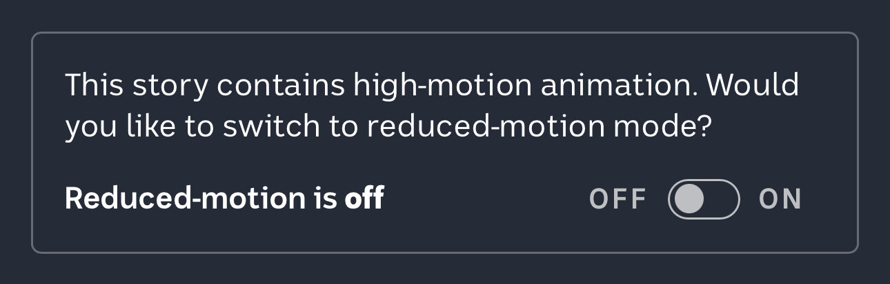

# High-motion notice and best toggle use I’ve even seen

The dialogue window shows care. I also like how the toggle to set the preference to ON or OFF has labels clearly indicating its status.

The text "Reduced-motion is off" makes it impossible to misunderstand. Toggles are not user-friendly components. It doesn’t matter how commonly used they are.

From the article [See your identity pieced together from stolen data](https://www.abc.net.au/news/2023-05-18/data-breaches-your-identity-interactive/102175688) on ABC News

Source: [Phil Sherry, seen on Mastodon](https://indieweb.social/@philsherry@home.social/110397186223695094)

#Accessibility #Toggle #Labels