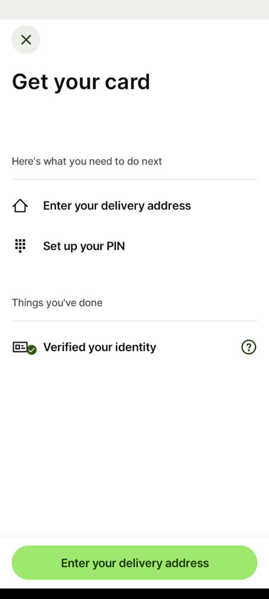
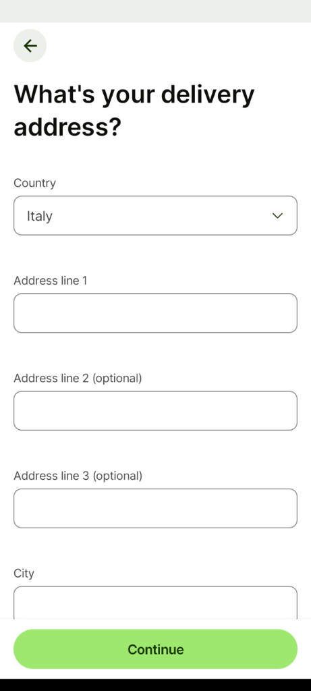
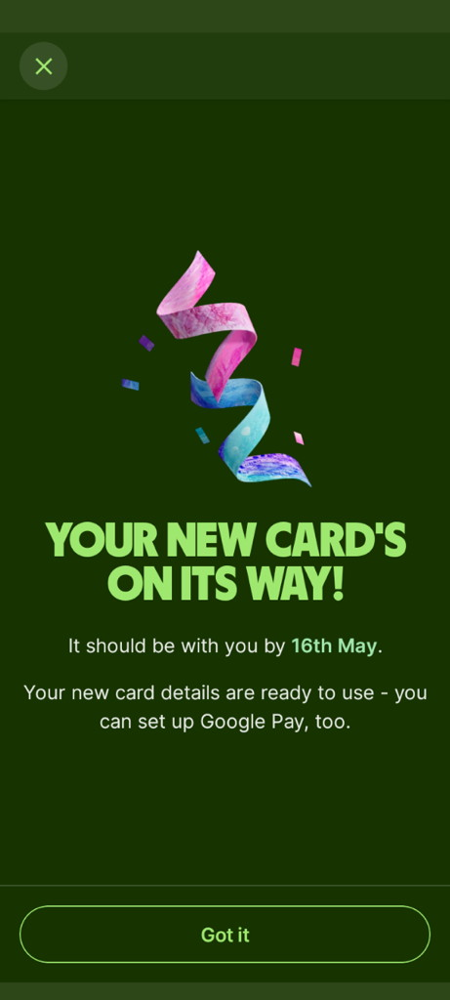
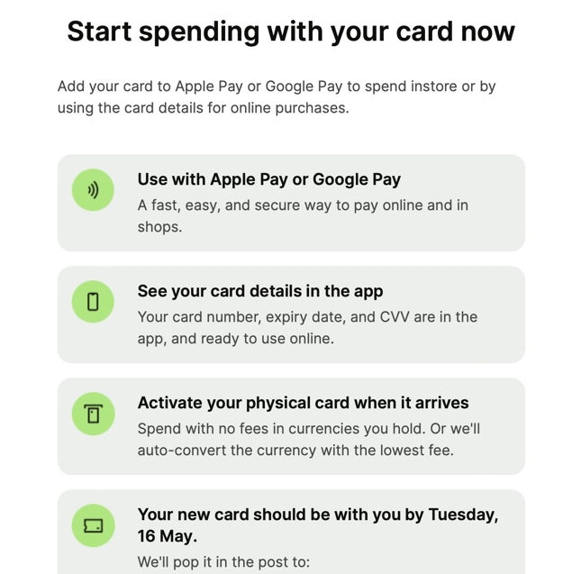

My Wise debit card expired. I received a push notification and ordered a new one once I got on a train. 

## The flow

A quick and easy three-step process.

On screen: 

1. What you need to do next
2. Things you’ve done
3. Button to continue and enter the delivery address

## Let’s start

***

## A few details needed

What's your delivery address?

***

## Done

Your card is on its way. There’s the date of possible delivery and the fact that the card’s details are ready to use.

---

## Let people know what’s next

#UX 